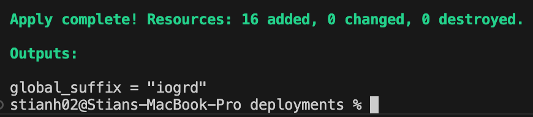
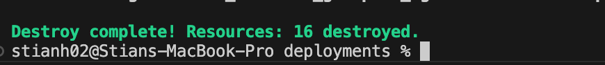

# Infrastructure as Code (IaC) for an IT Consultant Firm

## Modules

- **Network Module**
  The Network Module creates a networking infrastructure. It creates a Virtual Network (VNet) with a Subnet and a Network Security Group (NSG), that protects the Virtual machine (VM) from threats in in- and outbound traffic. It communicatex with the VM using a Network Interface (NIC) that is connected to the subnet. The network interface is passed to the VM module, using outputs, for integration.
- **Storage Account Module**
  The Storage Acount Module creates a Storage Account with a storage container within it. The storage access key is passed to the Key Vault, for secure storage. The Storage Account provides scalable, durable storage, while the container organizes data within the account.
- **Virtual Machine Module**
  Makes an Linux Virtual Machine (VM). The VM has a specific size and the networking information is passed from the Network module. The username and password for the VM are retrieved from Key Vault. The VM also has an OS disk configuration, and password authentication is enabled, so that it only need the password from Key Vault.
- **Key Vault Module**
  Creates a Key Vault to securely store sensitive information, including the VM username, password, and Storage Account access key. The Key Vault is configured with access policies that control the permissions for managing keys, secrets, and storage. The VM credentials are stored as secrets, with the username and a hardcoded password used for testing purposes. These credentials and the Storage Account access key are passed to, and used by, the VM and Storage modules.

## Pre-requisites
  
- Terraform 4.0.1 is installed.
- Azure CLI is installed and you are authenticated.
  
## How to Use the Terraform Scripts

1. **Initialize the Project**
You need to download the necessary Terraform providers and prepare your environment.
To do this, you need to navigate to the root folder of this project in your terminal and initialize using the init command:

``` bash  
terraform init
```

2. **Plan the Infrastructure**
Before applying changes, review the plan to see what Terraform will create or modify using the plan command:

``` bash
terraform plan
```

3. **Apply the Configuration**
Deploy the infrastructure using the apply command:

``` bash
terraform apply
```

4. **Destroy the Resources**
When the infrastructure is no longer needed, use the destroy command to clean up all resources:

``` bash
terraform destroy
```

## Output screenshots



